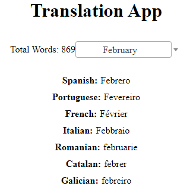

# Flask Translation Service

A web application built with Flask that offers translation functionalities via a RESTful API and a frontend interface. The app interacts with a SQLite database to fetch translations of words.



## Features

- **RESTful API Endpoints**:
    - Fetch translations of a given word.
    - Get a list of all unique words in the database.
    
- **Web Interface**:
    - Users can input a word to see its translations.
    - Display available languages and total word count.
    
- **Database**:
    - SQLite3 used for storage.
    - Contains a table with translations in multiple languages.

## Getting Started

### Prerequisites

- Python 3.x
- Flask
- SQLite3

### Installation

1. Clone the repository:
```bash
git clone https://github.com/edErikson/FlaskTranslationService.git
```

2. Navigate to the directory:
```bash
cd FlaskTranslationService
```

3. Install the required packages:
```bash
pip install -r requirements.txt
```
*// Note: You might want to create a requirements.txt file with the necessary packages.*

4. Run the application:
```bash
python app.py
```

Now, navigate to `http://127.0.0.1:5000/` in your browser to access the web interface.

## API Usage

- **Fetch translations**:
    - Endpoint: `/translate?word=YOUR_WORD`
    - Method: `GET`

- **Get all words**:
    - Endpoint: `/words`
    - Method: `GET`

## License

MIT